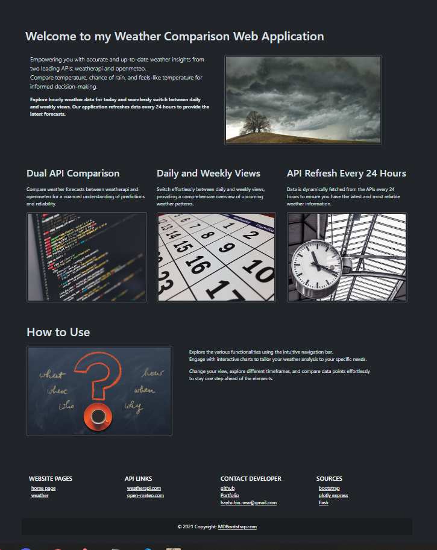
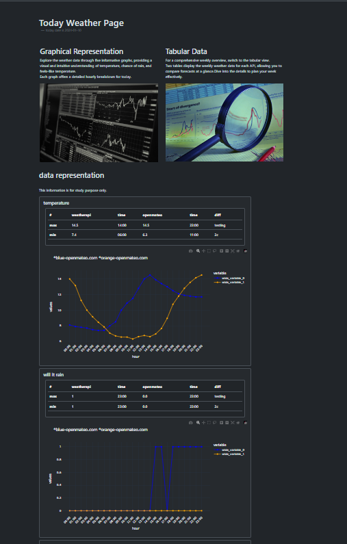
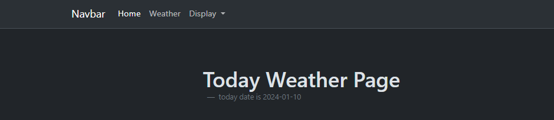
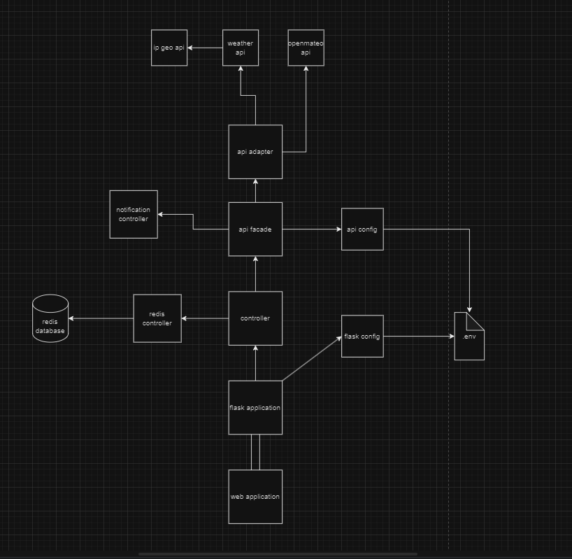
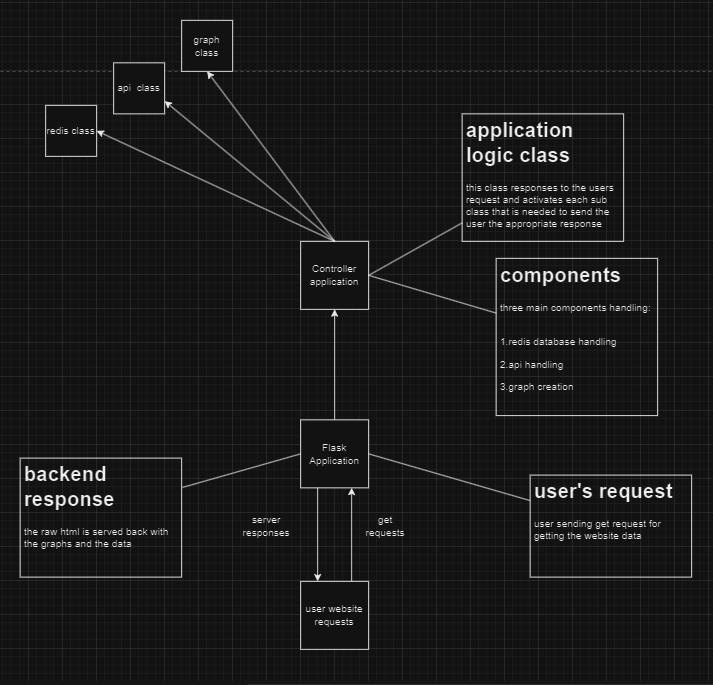
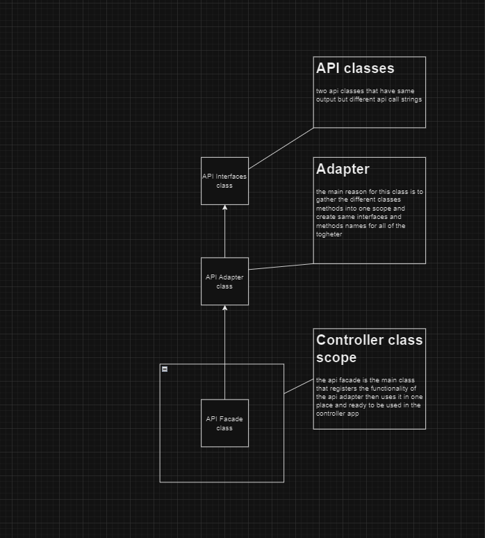

# Weather Application


## Overview
This is my small weather web application that have the data from two different API's.
The primary goal of the Weather Comparison Web Application is to empower users with a seamless and intuitive tool for comparing weather data from two distinct sources. By showcasing temperature, chance of rain, and feels-like temperature, web application data insures you that the data sometimes can be not so accurate.

## Table of Contents

- [Usage](#usage)
- [Installation](#installation)
- [Features](#features)
- [Screenshots](#screenshots)
- [Architecture](#architecture)
- [License](#license)

## Usage
#### Clients
- simple weather application that shows data of two different weather apis and the client can see the differences.

#### Developers
- code structure that easy to understand.
- easy to refactor or integrate new api.
- can be integrated with different weather API's just by creating a interface api class in the api_folder.py and then instantiate the api interface in the api adapter and api_facade.

## Installation

To install the application and utilize it alongside existing applications, you need to create accounts on a few websites (no payment required!). Save the API keys for each service in the local environment.:<br>
- weatherapi.com : this is one of the API's the application is using to get the data.
- open-meteo.com : this is one of the API's the application is using to get the data.
- ipgeolocation.com : this is needed to get the geolocation of the user's ip address to show the weather information by the location.
- redis.com : this is the database of the application that is connected with redis library in python.

#### now lets start with the configuration
create virtual environment and then inside the virtual envirnment install the libraries with this command:

```bash
# Example installation command
pip install -r requirments.txt
```

in the weather.py change the app.debug mode to True for running it in debug mode
```python
if __name__ == "__main__":
    app.secret_key = os.getenv('SECRET_FLASK_KEY')
    app.debug = False
    app.run()
```

go to main/env/ and create there .env file with the contents:

```.env
REDIS_HOST_URI = "your redis host"
REDIS_PORT = "redis port"(int)
REDIS_USERNAME = 'redis username'
REDIS_PASSWORD = 'redis password'
SECRET_FLASK_KEY = "secret flask key of the application"

#1000 calls per month
WEATHERAPI_API_URI = "http://api.weatherapi.com/v1" #this is the starter base uri
WEATHERAPI_API_KEY = "weatherapi key"
WEATHERAPI_NAME = "weatherapi.com"

#NO LIMIT
OPENMETEO_URI = "https://api.open-meteo.com/v1/forecast"
OPENMETEO_KEY = "no key"

OPENMETEO_SOURCE = "openmateo_api"
GEO_API_KEY = "geo_api_key"
```
now we almost ready.
to be continued


## Features
### 1.API Limited Calles.

Weatherapi API is limited to 1000 calls per month per user so each ip address that access the website is stored with the data that it got.

### 2. Location-Based Forecast

The weather is presented by the location of the user's IP address.

### 3. Interactive Graphs

Visualize weather patterns and explore different regions using an interactive Graphs that displays current conditions and forecasts.

### 4. Application Purpose

The main purpose is basicly to show you that there are always a differences in a forecast even if they updating the data its still not so accurate and not the same. 


## Screenshots

### 1. Home Screen



*Description: Overview of the main screen with description of the purpose and the application.*

### 2. Weather Page (Default Day View)



*Description: Visual representation of the current day weather by the hours, this is the basic representation.*

### 3. Display



*Description: You can change it to see weather information for the whole week starting from the current day.*

### 4. Weather Page (Week View)


*Description: Visual representation of the weather sorted by days, starting from the current day.*

## Architecture

Now, let's explore the interesting part of the application.

### Application Design Diagram



The top layer of the application is designed using the Model-View-Controller (MVC) pattern. Internally, additional design patterns are employed for code readability and simplicity.

**MVC (Model-View-Controller) Design Pattern Diagram**



   - Serves as the core of the application, handling requests from the UI.
   - Retrieves weather data from external APIs or data sources.

**Adapter Design Pattern Diagram**



   - Serves as the core of the application, handling requests from the UI.
   - Retrieves weather data from external APIs or data sources.

**Facade Design Pattern Diagram**


   - Serves as the core of the application, handling requests from the UI.
   - Retrieves weather data from external APIs or data sources.

### Component Diagram


*Description: The component diagram illustrates the relationships between different components of the Weather Application.*

In the diagram:

- The arrows represent the flow of data or requests between components.
- Each component is labeled with its specific responsibility.
- 

## License

This project is licensed under the MIT License - see the [LICENSE](LICENSE) file for details.

